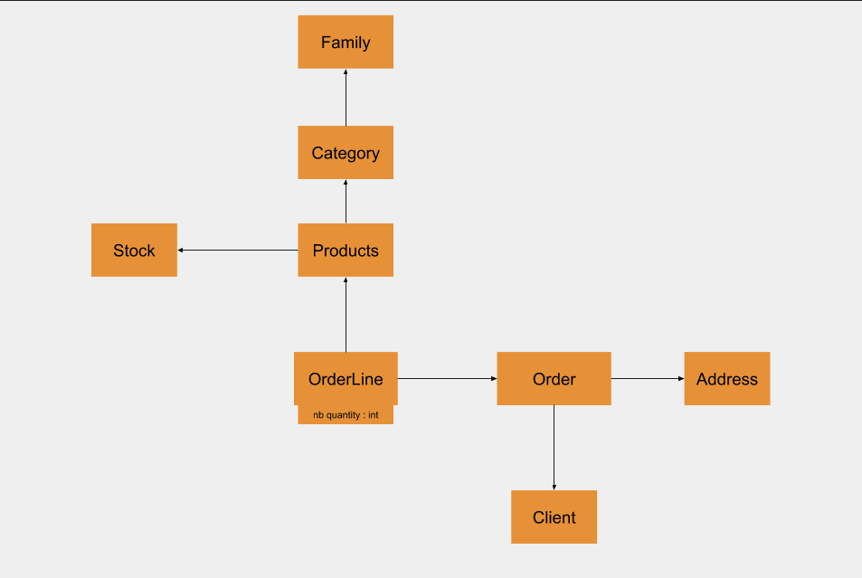

# ESHOP

## Objectif
   
- [ ] Creation d'un site de ventes en ligne
- [ ] Ajout de Produits (classe en categorie)
- [ ] Possibilite pour le proprietaire de ne pas afficher tous les produits
- [ ] Changement des prix ( affichage de promotions)
- [ ] interface moderateur facile a prendre en main
- [ ] Changement couleurs/template du site
- [ ] Paiement
   
## Technologies utilise

- PHP avec Laravel 6.6.0
- BD PostGreSQL 12.0
- ReactJS, JQuery, Ajax
    
## Createurs

- Maziarz Oliwier
- Raimbault Fantin

## UML

